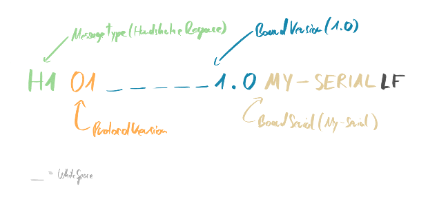

# SWPP - Simple WhitePawn Protocol

This Document explains how this Protocol is used. And how you can add it to your own project.

## Why use it?

This Protocol is a simple way for **everyone** to make their project compatible to the [WhitePawn App](https://whitepawn.app).

The WhitePawn App is a free Chess App where real Chessboards can be connected to. You can then play games against online players on Lichess or directly over the WhitePawn App. Also you are able to play against engines or only record a game played on the Board.

If you build your own Board or created any Hardware which can be seen as real Board, you can use the WhitePawn Protocol to communicate with the App over SerialUSB or BluetoothClassic/BluetoothLowEnergy. Keep in mind that SerialUSB and BluetoothClassic are only available on Android. So its recommended to use BLE.

Last but not least it is to mention that you do not need any registration process or code change in the WhitePawn App to support your Board, if your Board implements the SWPP, it is directly compatible with the WhitePawn App.

## Protocol Overview

To keep it very simple everything sent over the Protocol is ASCII printable. So you basicly just sent ASCII Text and receive ASCII Text. This makes debugging very easy.

**Every** Message sent over SWPP is encoded as follows:

| Field         | Description               | Length        |
| ------------- |:--------------------------|--------------:|
| Type          | Type of Message           | 2             |
| Payload       | Payload (optional)        | x             |
| LF            | EndSymbol (LF)            | 1             |

**Type** is just the type of the Message for example a Move or Handshake response.
**Payload** is the Data for the Message for example for a Move it would be the fields.
**LF** Is just the Lineending.

If its too abtract you will see many examples below.

## Communication Flow

The Communication Flow is also very easy. There is a Handshake Request at the beginning, sent from the WhitePawn App to your Board. You respond with an Handshake Response, after that everything is ready to go!

## Messages Overview

Here are all Messages listed. That means all Messages that are sent from the App and also all Messages which you can sent from your Board.

| Message              | Description               | Length        |
| -------------------- |:--------------------------|--------------:|
| Handshake Request    | First Message from App    | 2             |
| Handshake Response   | First Message from Board  | x             |

## Message: Handshake Request (H0)

The first Message the App sends to the Board after connection.

| Field            | Description               | Length        |
| ---------------- |:--------------------------|--------------:|
| H0               | Message Type              | 2             |
| ProtocolVersion  | Protocol Version in HEX   | 2             |
| AppBuild         | AppBuild Number in HEX    | 4             |
| LF               | EndSymbol (LF)            | 1             |

## Message: Handshake Response (H1)

The first Message the Board sends to the App after receiving the Handshake Request from the App.

| Field            | Description               | Length        |
| ---------------- |:--------------------------|--------------:|
| H1               | Message Type              | 2             |
| ProtocolVersion  | Protocol Version in HEX   | 2             |
| BoardVersion     | Board Version String      | 8             |
| BoardSerial      | SerialNumber String (opt) | x             |
| LF               | EndSymbol (LF)            | 1             |

## Message: New Game (NG)

If a new Game is started, the App will send this Message to the Board.

| Field            | Description               | Length        |
| ---------------- |:--------------------------|--------------:|
| NG               | Message Type              | 2             |
| GameType         | Type of the Game          | 1             |
| WaitingForMove   | Either Y/N                | 1             |
| LF               | EndSymbol (LF)            | 1             |

GameTypes:
- Offline Match (0)
- Engine Match (1)
- WhitePawn OnlineGame (2)
- Lichess OnlineGame (3)

## Message: Game Ended (GX)

If the Game Ended, this message is sent to the Board.

| Field            | Description               | Length        |
| ---------------- |:--------------------------|--------------:|
| GE               | Message Type              | 2             |
| GameType         | Type of Ending            | 1             |
| LF               | EndSymbol (LF)            | 1             |

GameTypes:
- Game Aborted (0)
- Checkmate (1)
- Draw (2)
- User Resigned (3)
- Opponent Resigned (4)

## Message: New Move on App (MA)

If a Move is made in the App by the opponent in an Online Match for example or by an engine on an engine game, the App sends this Message to the Board.

| Field            | Description               | Length        |
| ---------------- |:--------------------------|--------------:|
| MA               | Message Type              | 2             |
| Move             | Move String (PGN)         | 5             |
| LF               | EndSymbol (LF)            | 1             |

Move: Will be always from-to in following format: "a2a4" even if if something was taken. On Castling it is "0-0" or "0-0-0".

## Message: New Move on Board (MB)

If a Move is made on the Board this is sent from the Board to the App

| Field            | Description               | Length        |
| ---------------- |:--------------------------|--------------:|
| MB               | Message Type              | 2             |
| Move             | Move String (PGN)         | 5             |
| LF               | EndSymbol (LF)            | 1             |

Move: Always send in the notation "a2a4" even if something was taken. In case of castleing you can send "0-0" or "0-0-0".

